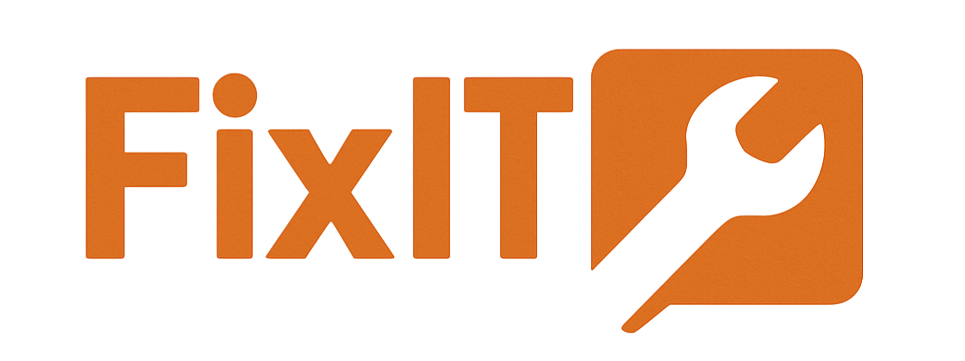

# 🛠️ FixIT - Plataforma de Gestión de Incidencias

FixIT es una aplicación web moderna para la gestión rápida y eficiente de incidencias técnicas en entornos empresariales. Permite a los usuarios reportar problemas, seguir su estado y recibir actualizaciones, mientras que los administradores pueden gestionar y resolver estas incidencias de manera organizada.



## 🚀 Características principales

### 👤 Sistema de usuarios con roles diferenciados
- **Usuarios**: Pueden reportar y consultar sus propias incidencias
- **Administradores**: Asignan, gestionan y resuelven tickets

### 🎫 Gestión completa de tickets
- Creación detallada con título, descripción, categoría y prioridad
- Adjuntar imágenes para mejor documentación de problemas
- Seguimiento en tiempo real del estado de las incidencias
- Comentarios para comunicación entre técnicos y usuarios

### 📊 Dashboard y estadísticas
- Visión general de tickets abiertos, en proceso y resueltos
- Distribución por categorías y prioridades
- Tiempo medio de resolución y métricas clave

### 💡 Gestión de sugerencias
- Canal dedicado para propuestas de mejora
- Revisión de las sugerencias por parte de administradores

### 🌐 Experiencia de usuario optimizada
- Interfaz responsive para móvil, tablet y escritorio
- Modo claro/oscuro para mejor visualización
- Soporte multiidioma (Español e Inglés)

## 🛠️ Tecnologías utilizadas

- **Framework**: Vite
- **Frontend**: React con TypeScript
- **Estilado**: Tailwind CSS para diseño responsive
- **Backend**: Supabase (PostgreSQL + APIs autogeneradas)
- **Autenticación**: Sistema JWT con Supabase Auth
- **Gestión de estado**: React Query para datos del servidor
- **Routing**: React Router
- **Formularios**: React Hook Form + Zod para validación
- **Almacenamiento**: Supabase Storage para archivos adjuntos

## 🔒 Características de seguridad

- Autenticación segura mediante JWT
- Autorización basada en roles
- Protección contra vulnerabilidades comunes (XSS, CSRF)
- Validación de datos en cliente y servidor
- Políticas de seguridad Row Level Security (RLS) en base de datos

## 📱 Diseño Responsive

La aplicación está diseñada siguiendo principios mobile-first, adaptándose perfectamente a:
- Dispositivos móviles
- Tablets
- Escritorio

## 🚀 Flujo de trabajo típico

1. El usuario reporta una incidencia técnica desde su cuenta
2. Un técnico se asigna a la incidencia y se actualiza automáticamente su estado a "En progreso"
3. El técnico y el usuario pueden comunicarse mediante comentarios
4. Al resolver el problema, el técnico marca la incidencia como "Resuelta"

## 🛠️ Instalación y configuración

```bash
# Clonar el repositorio
git clone https://github.com/usuario/fixit.git
cd fixit

# Instalar dependencias
npm install
# o usando el script incluido
./install-deps.bat

# Iniciar servidor de desarrollo
npm run dev
# o usando el script incluido
./start-dev.bat
```

## 📚 Documentación

La aplicación cuenta con documentación disponible:
- Manual de usuario y administrador integrado en la aplicación
- Ayuda contextual en funciones complejas

## 🧪 Testing

El proyecto incluye:
- Pruebas unitarias para componentes individuales
- Pruebas de integración para flujos completos
- Pruebas de usuario para validar la experiencia

## 🌱 Roadmap futuro

- Implementación de sistema de notificaciones push y por email
- Implementación de dashboard analítico avanzado
- Sistema de tickets recurrentes
- Implementación de PWA para acceso offline
- Asignación automática de tickets basada en carga de trabajo

## 👥 Contribución

Por ahora este es un proyecto privado. No se admiten contribuciones de desarrolladores externos.

## 📄 Licencia

Este proyecto está bajo la Licencia MIT. Consulta el archivo LICENSE para más detalles.

---

Desarrollado con ❤️ por el equipo de FixIT para facilitar la gestión de incidencias técnicas.


